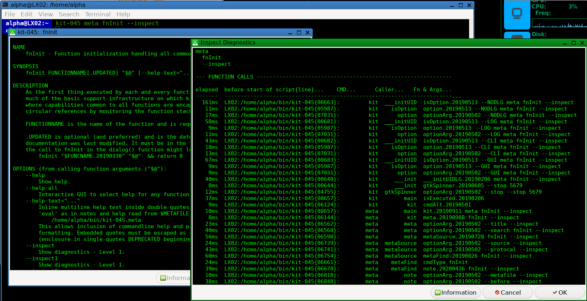

# kit-045
*Code Revised 2019-09-11 by docsalvager*

(EXPERIMENTAL)

A "self-documenting" bash (not POSIX) "framework" of functions that encapsulate a few best practices as well as experimental techniques. The priorities have been ...
  - to maximize functionality
  - to maximize performance
  - to maximize readability and thus...
  - to minimize develpment (and thus debugging) time for enhancements and bug-fixes

Kit uses every "bashism" I can find since anything done in compiled code is many times faster than anything done in script. It would be impractical to try to make `kit` POSIX-compliant as it depends heavily upon bash introspection facilities like the `FUNCNAME[]` array that do not exist in POSIX shells.

## Features
  - A symlink pointing to the `kit` symlink or `kit-045` script with the name of a `kit` function, will initialize `kit` and invoke that function just as if it were called inside a script that sourced `kit`.
  - User interaction functions try to use the best user interface tool available like `yad`(GTK GUI), `dialog`(curses graphics) or commandline text (CLI).
  - Extensive diagnostic functions like the `--inspect` option to aid debugging.
  - Extensive manpage-like help documentation for every single function (stored in `kit-045.meta`).

## Files
  `kit` is just a symlink to kit-045.

  `kit.meta` is just a symlink to kit-045.meta.
  
  `kit-045` is the executable script.
  
  `kit-045.meta` is the full, detailed documentation for each function in a format much like manpages and is also executable but doesn't do much. It is made executable because it contains executable code in the form of Command Substitution `$( ... )` within the help text. `kit-045` searches `kit-045.meta` for the function variable and returns the text value. Sometimes this may include text inserted via Command Substitution.

## Getting Started (recommended)

  - **Setup `kit` environment**
    - Create a directory for everything related to `kit` except the user's `kit-045.conf` file.
      ~~~
      /opt/DocSalvager
      ~~~
    - Create the `bin` and `lib` subdirectories
      ~~~
      /opt/DocSalvager/bin
      /opt/DocSalvager/lib
      ~~~
    - Put files in appropriate directories
      - Place `kit`, `kit-045` and `kit-045.meta` in `/opt/DocSalvager/lib`
      - Create symlinks to lib files from bin
        ~~~
        cd /opt/DocSalvager/bin
        ln -s ../lib/kit kit
        ln -s ../lib/kit-045 kit-045
        ln -s ../lib/kit-045.meta kit-045.meta
        ~~~
    - Place `kit-045.conf` in a `/home/<user>/.config/kit` directory.
      - Insure that `HOMEDIR=` setting is...
        ~~~
        HOMEDIR="/opt/DocSalvager"
        ~~~

  - **Setup user environment to access `kit` environment**
    - This can be done several ways and if you already have one that works for you, then use it. Here are two. _(And yes, it's too involved and too fragile. Will be improved in a future version... probably `kit-047`.)_
    - Technique #1 - Add `/opt/DocSalvager/bin` to `$PATH`
      - Edit user's `.bashrc` file to append bin directory to `$PATH`.
        - For example, if current `$PATH` ends in a colon (:)...
          ~~~
          PATH=$PATH/opt/DocSalvager/bin:
          ~~~
    - Technique #2 - Setup user `bin` and `lib` directories for per user code and add to `$PATH`
      - Why use this?
        - Bash's searching of `$PATH` does not support recursion into subdirectories so each directory to search must be explicitly listed in `$PATH`. Thus, we want to minimize the number of these required while still minimizing the work involved with additions.
        - There is a limit to the total length of pathnames so we want to keep names short but descriptive.
        - Chaining symlinks like this does not add measurably to responsiveness in normal use. (Just don't write a `for` loop with hundreds of iterations going through long symlink chains.) 
      - Create `~/bin` and `~/lib` directories
        - Why?
          - `bin` is strictly for user's symlinks (preferably `relative` instead of `absolute`) to scripts and commands.
          - `lib` is for user's scripts and so most `bin` symlinks will probably point to these as in
            ~~~
            ln -s ../lib/script-ver script`)
            ~~~
        - Commands
          ~~~
          cd $HOME
          mkdir bin lib
          cd $HOME/bin
          ln -s /opt/DocSalvager DocSalvager
          ln -s DocSalvager/kit            kit
          ln -s DocSalvager/kit-045        kit-045
          ln -s DocSalvager/kit-045.meta   kit-045.meta
          ~~~

## Using kit
The kit script can be used in 3 ways...
  - It can be run from the command line
    - `kit`
    - `kit --help`
      - Displays help in a scrollable window (assuming `yad` or `dialog` are available) for the `kit()` function which starts off everything.
    - `kit meta fnInit`
      - Displays help in a scrollable window for the `fnInit()` function which is called at the beginning of every other function to handle `--help`, `--version` and a number of other common options.
    - `kit meta fnInit --inspect`
      - Displays help in a scrollable window for the fnInit() function as well as a diagnostic window showing the function stack and other debugging information. This will noticeably slow down execution as all debuggers do so the timings should be considered relative to each other rather than absolute.
    - In the directory with `kit-045`, create a symlink that runs the `meta()` function.
      - The name must _*exactly*_ match the function name.
        ~~~
        ln -s kit-045 meta
        ~~~
      - Then use the new command...
        ~~~
        meta fnInit
        ~~~
  - It can be sourced at the beginning of another script which will load the entire script into memory (currently 266K) and allow its functions to be called exactly like they call each other.
    ~~~
    source /opt/DocSalvager/bin/kit
    ~~~
  - Without sourcing it, any `kit` function can be called from within another script just like a command. _(If there is a symlink to `kit` with the exact same name as a `kit` function as done above with `meta`, the `kit` prefix shown below is not required. But be careful to avoid conflicts with existing commands as `dialog` would be!)_
    ~~~
    _help="
    NAME
      ...
    DESCRIPTION
      ...
      :
    "
    #
    `if [[ "$1" == "--help" ]]
    then
      kit dialog --title="MyScript" -- "$_help"
    fi
    ~~~

## GUI and CLI Interface
`kit-045` attempts to use the best interface available for user interaction. Currently, `yad`, `dialog` and plain text (CLI) are supported. Zenity support is in there but is deprecated and will be removed in future versions. There are a common set of options (`--GUI`, `--CLI`, `--NODLG`) to override the default behavior that can be used with any function.

## Bugs
I'm sure there are numerous bugs and ways things could be done better. Improvements and fixes are welcome and the best ones will be incorporated into future versions.

With the exception of one-time initialization code at the beginning of the script, **_everything_** is done in defined functions with a call at the end to get things started.

## Submitted Changes
Please make a copy of the function to be changed and append '\_1' (without quotes) or similar. Only underscores (\_) are used since there are many variables derived from function names. This suffix will require each other function that calls this function to be likewise changed to use the new name. This will alert us to the other functions that need to be tested against the change. If there are many functions affected, please list the main ones and note that there are others. Please document extensively as to **why** the change is necessary or better and what is being accomplished. Restating in prose what the code clearly shows does not add anything useful.

  ### Backward Compatibility
  Examine the `kit-045` script for examples of how to support backward compatibility with function name synonyms built using the `aliasOf()` function. This same mechanism can be used to create "alias functions" with all lowercase names (or completely different names) that will then work with symlinks of that name pointing to `kit`.

## Code Styling For Easier Debugging
"Over 90% of development time is (or should be) spent in debugging."

Every programmer settles on the coding style that works for them. Mine is intended to ease debugging. While always willing to listen to new ideas, having done this since 1981, this is the style that works for me. I ask that you try to conform to it as best you can and tell me why your way is better when you can't. You might be right.

That said, the first thing you'll notice is that I put most comments _after_ the code and indented with 3 hashes and a space. Please never forget the space. The style of comments without a space are very hard to read and add no measurable speed to code execution.

Comments are _after_ the code because it is the code that is being executed and thus what is important in debugging. Comments can often be misleading until they are changed to reflect the final version of the code line.

In fact you'll find a lot of techniques in kit that violate common practice. Be assured that I have spent days experimenting with different techniques and found that a great many of the "best practices" in common use do not speed up execution appreciably, often slow it down, and very often make debugging harder. Bash has clearly been designed to acheive the best performance possible without limiting powerful functionality. Like regular expressions, that often means cryptic syntax. I've done the best I can to explain what's happening (for my future befuddled self at the least).

## Future Versions
Currently working on kit-047 which has a number of core changes and so is incompatible with kit-045. For the curious, kit-046 was a rabbithole I went down and abandoned.
